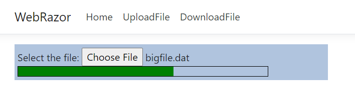

# Asp.Net big files upload experiments

**This is just a demo!!!** 

Key points:
 - big files file upload using javascript : original file splitted in chunks and uploaded sequentially
 - server-side uploaded files rebuilt from incoming chunks
 - server-side implemenations:
   - Asp.Net Core 3.1 : razor / api controller
   - Asp.Net Framework 4.7 : ashx handler
 - same client-side javascript for asp.net (aspx) and asp.net core (razor)
   - reference file: uploadfile.js placed in the parent folder. Use UploadFile_CopyToProjects.cmd to copy the file to to asp.net and asp.net core projects folder.
 - **Important for real projects**:
   - protect upload endpoints with authentication and authorization. 
   - limit the maximum size of uploadable files to prevent disk / storage space issues and abuse

 
 
 

