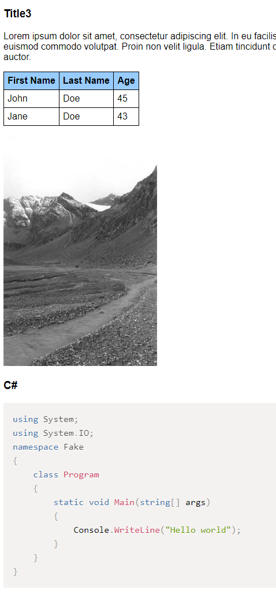

# Html rendering of a GitHub MD file
This sample shows how to retrieve a MD file from GitHub, render it locally to HTML using Markdig library and then show it as a web page. The project is an Asp.Net (.NET Framework) web app. The logic can be easily adapted to Asp.Net Core (...todo).

 - simple.aspx : gets the content from GitHub and renders it to html. Images are left on GitHub and referenced as &lt;img href=""&gt;
 - full.aspx : full solution with local caching of html and images and use of PrismJS for syntax highlighting of code blocks.

Links:
 - Markdig  https://github.com/lunet-io/markdig
 - Prism  https://prismjs.com/

Output example [sample1.md](mdsample/sample1.md):

